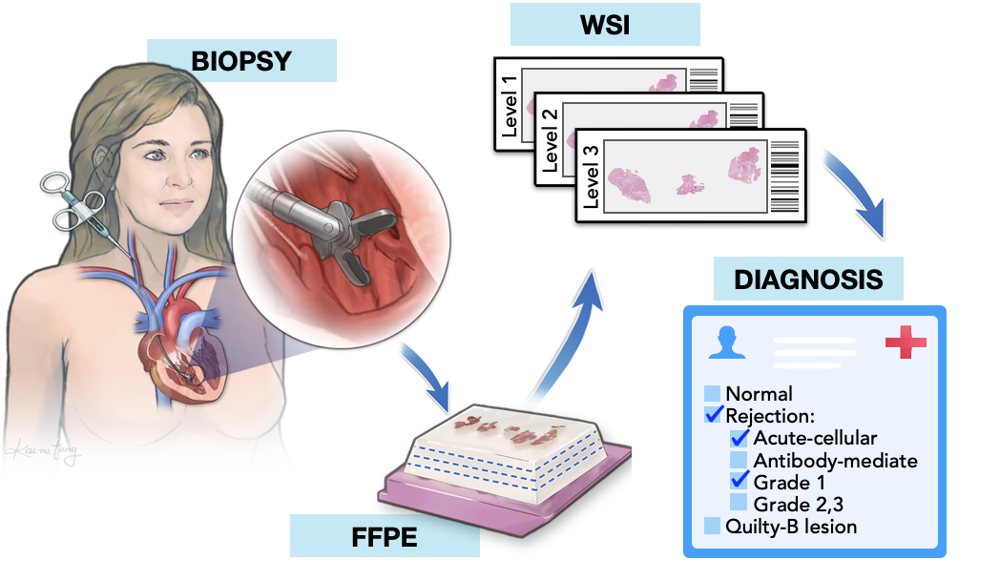
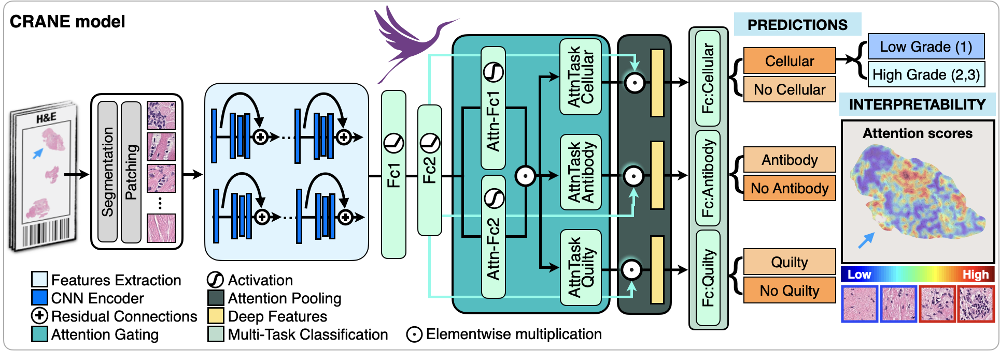

### CRANE: Cardiac Rejection Assessment Neural Estimator CRANE 
CRANE  is  a  high-throughput,  interpretable,  multi-task  framework  that  simultaneously  address the main diagnostic tasks in endomyocardial biopsy screening: acute cellular rejection,antibody-mediated rejection and quilty B lesions, as well as their concurrent appearances (e.g.cellular rejection with quilty lesions). For the detected rejection, the model estimates also the rejection grade.\
\
**Figure 1: Endomyocardial biopsy assessment.** *Fragments of endomyocardial tissue biopsied from the right ventricle underwent formalin fixation and paraffin embedding (FFPE).Each paraffin block was cut into slides with three consecutive levels and stained with hematoxylin and eosin(H&E). Each slide was digitized and served as an input for the model. Ground truth diagnoses to include rejection type and severity were distilled from each pathology report.*

Thanks  to  the  weakly-supervised  formulation,  the  model  can  be  trained  using  the  patient  diagnosis  as  the only labels, surpassing the needs and limitations of manually annotated diagnostic regions for each task.  The architecture of the CRANE model is depicted in Figure 2. CRANE takes as input digitized H&E stained WSI, which represent the gold standard in endomyocardial biopsy assessment.

**Figure 2: Crane model.** *A weakly supervised multi-task, multi-label network was constructed to simultaneously identify healthy tissue and different rejection conditions (cellular,antibody and/or quilty lesions).  A multiple instance learning approach is used to enable model training from the patient’s diagnosis as the only labels, surpassing the need for slide-level diagnosis or pixel-level annotations of relevant image regions.  A separate classifier is trained to estimate the rejection grade.  Model assigns attention scores to each image region reflecting its relevance for the diagnosis. The high-attention regions can be use to interpret the model’s prediction and validate the accuracy of the diagnosis. Shown attention heat map for the cellular rejection task.*


## Pre-requisites:
* Linux (Tested on Ubuntu 18.04)
* NVIDIA GPU (Tested on Nvidia GeForce RTX 2080 Ti x 16)
* Python (3.7.5), h5py (2.10.0), matplotlib (3.1.1), numpy (1.18.1), opencv-python (4.1.1), openslide-python (1.1.1), openslide (3.4.1), pandas (0.25.3), pillow (7.0.0), PyTorch (1.5.0), scikit-learn (0.22.1), scipy (1.3.1), tensorflow (1.14.0), tensorboardx (1.9), torchvision (0.4.2).

### Installation Guide for Linux (using anaconda)
[Installation Guide](https://github.com/mahmoodlab/CLAM/blob/master/docs/INSTALLATION.md)


### Data Preparation
We chose to encode each tissue patch with a 1024-dim feature vector using a truncated, pretrained ResNet50. For each WSI, these features are expected to be saved as matrices of torch tensors of size N x 1024, where N is the number of patches from each WSI (varies from slide to slide). The following folder structure is assumed:
```bash
DATA_ROOT_DIR/
    └──DATASET_DIR/
        ├── slide_1.pt
        ├── slide_2.pt
        └── ...
```
DATA_ROOT_DIR is the base directory of all datasets (e.g. the directory to your SSD). DATASET_DIR is the name of the folder containing data specific to one experiment and features from each slide is stored as a .pt file inside this folder.

Please refer to refer to [CLAM](https://github.com/mahmoodlab/CLAM) for examples on how perform this feature extraction step.


### Training Splits
For evaluating the algorithm's performance, we randomly partitioned our dataset into training, validation and test splits. These splits can be automatically generated using the create_splits.py script:
``` shell
python create_splits.py --cardiac --seed 1 --k 1
```

### Training
``` shell
CUDA_VISIBLE_DEVICES=0 python main.py --drop_out --early_stopping --lr 2e-4 --k 1 --exp_code cardiac_output  --task cardiac  --log_data  --data_root_dir DATA_ROOT_DIR
```
The GPU id to use can be specified using CUDA_VISIBLE_DEVICES, in the example command, the 1st GPU is used (4 in total). Other arguments such as --drop_out, --early_stopping, --lr, --reg, and --max_epochs can be specified to customize your experiments.

For information on each argument, see:
``` shell
python main.py -h
```

By default results will be saved to **results/exp_code** corresponding to the exp_code input argument from the user. If tensorboard logging is enabled (with the arugment toggle --log_data), the user can go into the results folder for the particular experiment, run:
``` shell
tensorboard --logdir=.
```
This should open a browser window and show the logged training/validation statistics in real time.


### Evaluation
User also has the option of using the evluation script to test the performances of trained models. Examples corresponding to the models trained above are provided below:
``` shell
CUDA_VISIBLE_DEVICES=0 python eval.py --drop_out --k 1 --models_exp_code cardiac_100_s1 - --task cardiac  --results_dir results --data_root_dir DATA_ROOT_DIR
```
For information on each commandline argument, see:
``` shell
python eval.py -h
```


**Figure 3: Attention maps of regions used to make classification determinations.**


## Issues
- Please report all issues on the public forum.

## License
© [Mahmood Lab](http://www.mahmoodlab.org) - This code is made available under the GPLv3 License and is available for non-commercial academic purposes.


